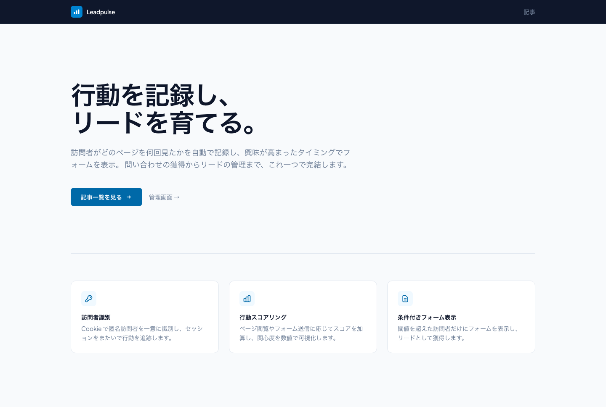
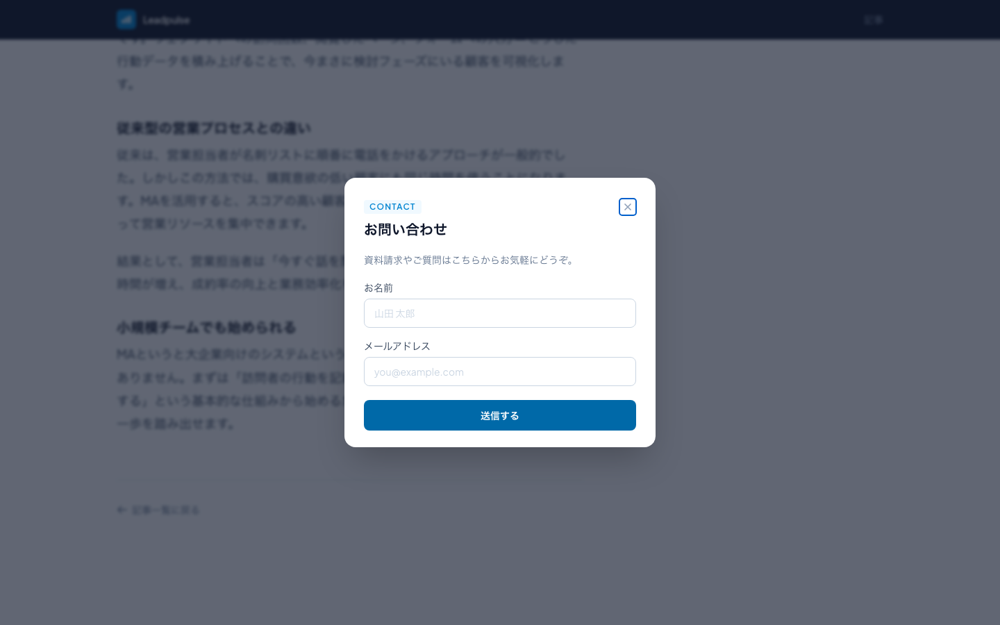
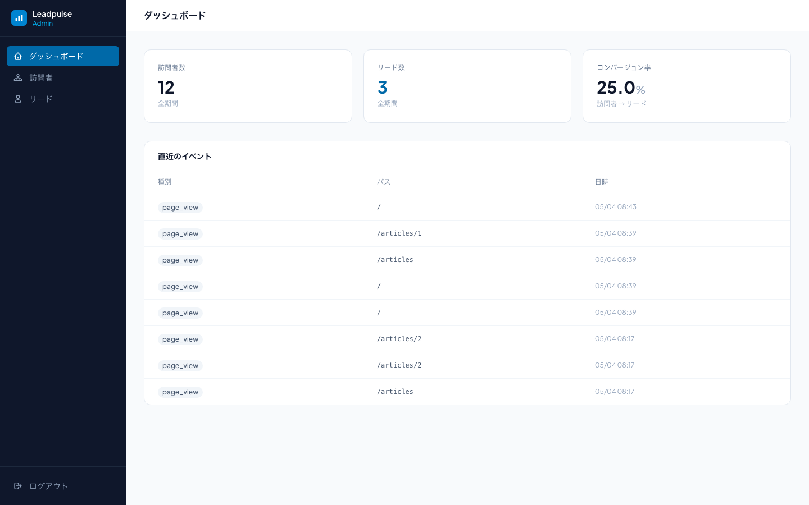
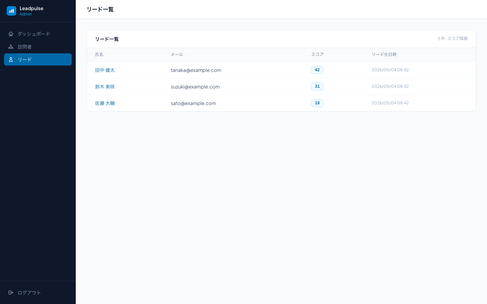

# Leadpulse

マーケティングオートメーション（MA）ツール


## 目的

- MAツールに興味を持ち、実際に簡易的に作ってみることで仕組みを理解したい。
- Claude CodeのSkills、GitHub Actions、AIによるレビューなどを試し、開発をフローを効率化したい。

## 機能

```
訪問者識別（Cookie）→ 行動記録 → スコアリング → 条件判定 → フォーム表示 → リード化
```

**公開サイト** — Cookie で匿名訪問者を識別し、ページ閲覧をスコアとして蓄積。閾値を超えると問い合わせフォームがモーダルで表示されます。

| 記事一覧 | フォームモーダル（スクロール後に表示） |
|---|---|
|  |  |

**管理画面** — フォーム送信でリード化。ダッシュボードでコンバージョン率を確認でき、リード一覧はスコア降順で管理できます。

| ダッシュボード | リード一覧（スコア降順） |
|---|---|
|  |  |

## 技術スタック

| カテゴリ | 採用技術 |
|---|---|
| バックエンド | Ruby 3.4.9 / Rails 8.1.3 |
| フロントエンド | Tailwind CSS v4 / Hotwire（Turbo + Stimulus） |
| データベース | SQLite3 |
| 認証 | Rails 8 標準認証 |
| テスト | RSpec / FactoryBot / Capybara（71 examples） |

## セットアップ

```bash
bundle install
bin/rails db:setup
bin/dev
```

`http://localhost:3000` で公開ページが表示されます。

**管理画面**：`http://localhost:3000/session/new` からログイン（「テストログイン」ボタンでワンクリック可）

| メールアドレス | パスワード |
|---|---|
| admin@example.com | password |

## テスト

```bash
bundle exec rspec
```

## ドキュメント

| ファイル | 内容 |
|---|---|
| `docs/requirements.md` | 機能要件・MVP スコープ |
| `docs/design.md` | ERD・クラス設計・コントローラ責務 |
| `docs/tasks.md` | 実装チケット一覧（T01〜T12） |
