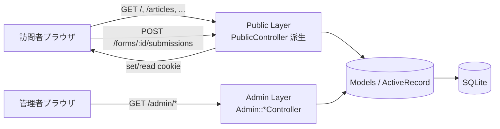
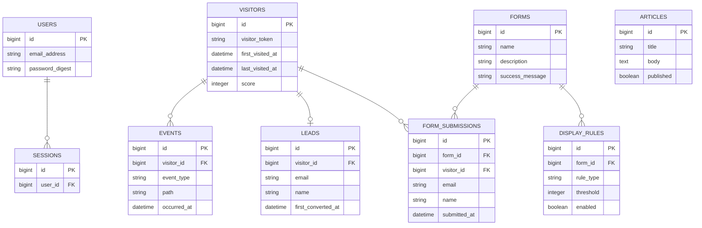
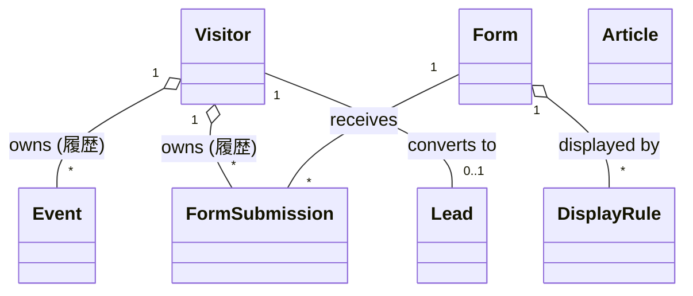
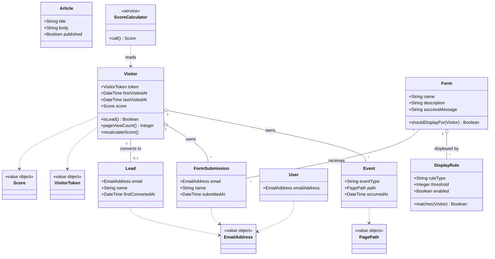
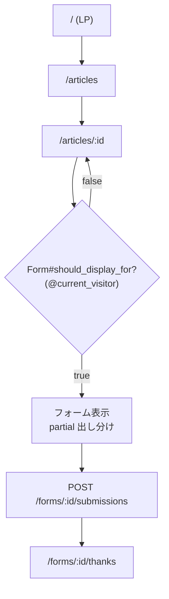
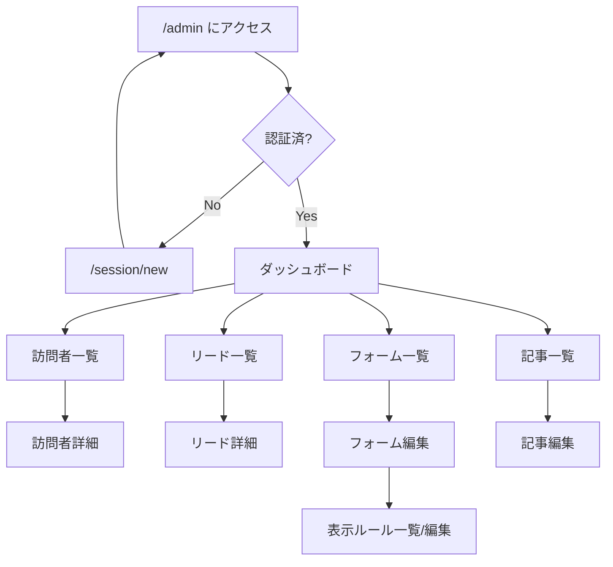
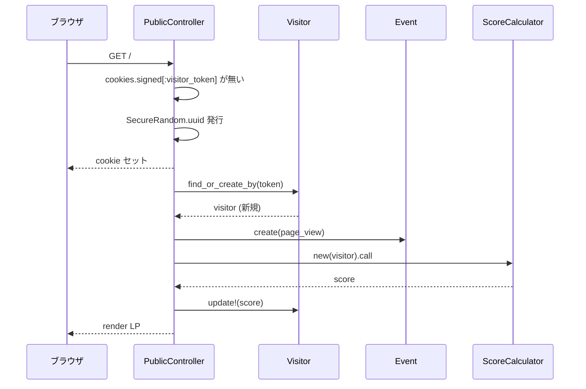
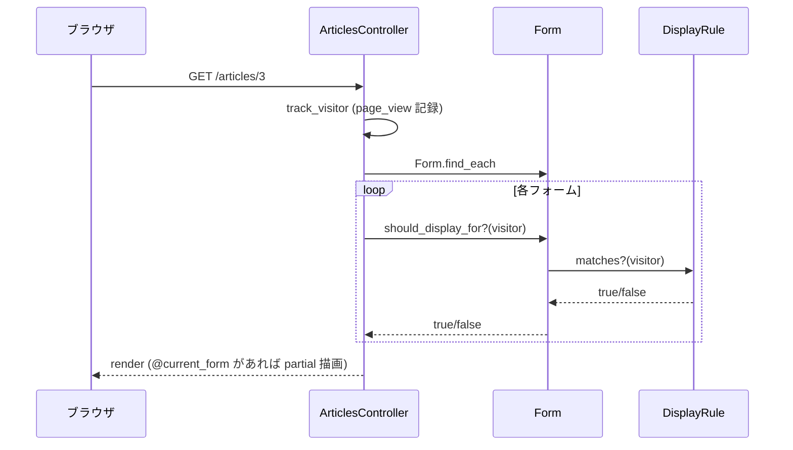
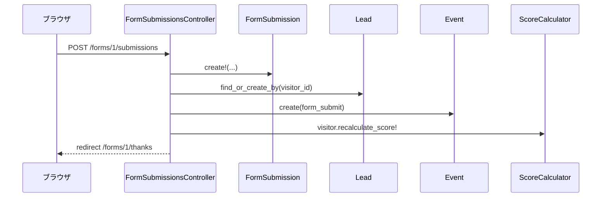

# マーケティングオートメーション学習用MVP 設計書

> 本書は [`docs/requirements.md`](./requirements.md) で定めた要件をベースに、**「どう作るか」** を具体化する設計ドキュメントである。
>
> 関連ドキュメント:
> - 要件定義: [`docs/requirements.md`](./requirements.md)
> - 開発タスク・実装順序: [`docs/tasks.md`](./tasks.md)

---

## 目次

1. システムアーキテクチャ
2. ディレクトリ構成
3. URL設計 (ルーティング)
4. 主要データモデル / テーブル案
5. ドメインモデル
6. classDiagram
7. モデル責務とバリデーション
8. コントローラ責務
9. 画面遷移詳細
10. スコア計算の責務分担
11. 表示ルール判定の責務分担
12. セキュリティ設計
13. 実装上の注意点

---

## 1. システムアーキテクチャ

### 1.1 全体構成

単一の Rails モノリス。公開側(訪問者向け)と 管理側(管理者向け)を1つのアプリ内で名前空間で分離する。



### 1.2 レイヤー方針

| レイヤー | 役割 |
|---|---|
| Routes | URL と コントローラの対応を定義 |
| Controllers (Public) | 公開ページの表示。before_action で訪問者識別と行動記録を行う |
| Controllers (Admin) | 管理画面表示。before_action で認証チェック |
| Models (ActiveRecord) | DBレコードと、レコード単位の責務 |
| PORO (`ScoreCalculator`) | レコードを跨ぐドメインロジック(スコア計算)を切り出す |
| Views (Tailwind) | 表示。フォーム表示判定はサーバーサイドで行い、partial で出し分け |

### 1.3 リクエスト処理の大原則

- **公開側**: 全リクエストで `before_action` により
  1. 訪問者識別 (cookie)
  2. ページ閲覧イベント記録
  3. スコア再計算
  を1箇所にまとめる
- **管理側**: 全リクエストで `before_action` により認証チェック

---

## 2. ディレクトリ構成

```
ma-cc/
├── app/
│   ├── controllers/
│   │   ├── application_controller.rb
│   │   ├── concerns/
│   │   │   └── authentication.rb            # generate authentication 由来
│   │   ├── public_controller.rb             # 公開側ベース (トラッキング)
│   │   ├── home_controller.rb               # GET /
│   │   ├── articles_controller.rb           # GET /articles, /articles/:id
│   │   ├── form_submissions_controller.rb   # POST /forms/:form_id/submissions
│   │   ├── forms_controller.rb              # GET /forms/:id/thanks
│   │   ├── sessions_controller.rb           # generate authentication 由来
│   │   └── admin/
│   │       ├── application_controller.rb    # 管理側ベース (認証)
│   │       ├── dashboard_controller.rb
│   │       ├── visitors_controller.rb
│   │       ├── leads_controller.rb
│   │       ├── forms_controller.rb
│   │       ├── display_rules_controller.rb
│   │       └── articles_controller.rb
│   ├── models/
│   │   ├── application_record.rb
│   │   ├── user.rb                          # generate authentication 由来
│   │   ├── session.rb                       # generate authentication 由来
│   │   ├── current.rb                       # generate authentication 由来
│   │   ├── article.rb
│   │   ├── visitor.rb
│   │   ├── event.rb
│   │   ├── form.rb
│   │   ├── form_submission.rb
│   │   ├── lead.rb
│   │   ├── display_rule.rb
│   │   └── score_calculator.rb              # PORO (拡張ポイント)
│   ├── views/
│   │   ├── layouts/
│   │   │   ├── application.html.erb
│   │   │   └── admin.html.erb
│   │   ├── home/
│   │   ├── articles/
│   │   ├── forms/
│   │   ├── form_submissions/
│   │   ├── shared/
│   │   │   └── _form_for_visitor.html.erb   # 表示ルール対応 partial
│   │   └── admin/
│   │       ├── dashboard/
│   │       ├── visitors/
│   │       ├── leads/
│   │       ├── forms/
│   │       ├── display_rules/
│   │       └── articles/
│   └── helpers/
├── config/
│   └── routes.rb
├── db/
│   ├── migrate/
│   └── seeds.rb
├── spec/
│   ├── models/
│   ├── requests/
│   ├── system/
│   └── rails_helper.rb
└── docs/
    ├── requirements.md
    ├── design.md
    └── tasks.md
```

---

## 3. URL設計 (ルーティング)

### 3.1 routes.rb の方針

```ruby
Rails.application.routes.draw do
  # 公開側
  root "home#show"
  resources :articles, only: %i[index show]

  resources :forms, only: [] do
    member do
      get :thanks
    end
    resources :submissions, only: %i[create], controller: "form_submissions"
  end

  # 認証 (Rails 8 標準)
  resource :session, only: %i[new create destroy]
  resources :passwords, param: :token

  # 管理側
  namespace :admin do
    root "dashboard#show"
    resources :visitors, only: %i[index show]
    resources :leads, only: %i[index show]
    resources :forms do
      resources :display_rules
    end
    resources :articles
  end
end
```

### 3.2 公開側 URL一覧

| Method | URL | コントローラ#アクション | 役割 |
|---|---|---|---|
| GET | `/` | `home#show` | LP |
| GET | `/articles` | `articles#index` | 記事一覧 |
| GET | `/articles/:id` | `articles#show` | 記事詳細 |
| POST | `/forms/:form_id/submissions` | `form_submissions#create` | フォーム送信 |
| GET | `/forms/:id/thanks` | `forms#thanks` | 送信完了 |

### 3.3 認証 URL一覧 (Rails 8 標準ジェネレータ)

| Method | URL | アクション | 役割 |
|---|---|---|---|
| GET | `/session/new` | `sessions#new` | ログインフォーム |
| POST | `/session` | `sessions#create` | ログイン処理 |
| DELETE | `/session` | `sessions#destroy` | ログアウト |

> 要件定義書の「管理者ログイン /admin/login」は実際には `/session/new` に対応する。`/admin` に未認証でアクセスされた場合は `/session/new` にリダイレクトする。

### 3.4 管理側 URL一覧

| Method | URL | コントローラ#アクション | 役割 |
|---|---|---|---|
| GET | `/admin` | `admin/dashboard#show` | ダッシュボード |
| GET | `/admin/visitors` | `admin/visitors#index` | 訪問者一覧 |
| GET | `/admin/visitors/:id` | `admin/visitors#show` | 訪問者詳細 |
| GET | `/admin/leads` | `admin/leads#index` | リード一覧 (スコア降順) |
| GET | `/admin/leads/:id` | `admin/leads#show` | リード詳細 |
| GET | `/admin/forms` | `admin/forms#index` | フォーム一覧 |
| GET | `/admin/forms/:id/edit` | `admin/forms#edit` | フォーム編集 |
| GET | `/admin/forms/:form_id/display_rules` | `admin/display_rules#index` | 表示ルール一覧 |
| GET | `/admin/forms/:form_id/display_rules/:id/edit` | `admin/display_rules#edit` | 表示ルール編集 |
| GET | `/admin/articles` | `admin/articles#index` | 記事一覧 (管理) |
| GET | `/admin/articles/:id/edit` | `admin/articles#edit` | 記事編集 |

---

## 4. 主要データモデル / テーブル案

学習用MVPとして 8テーブルに抑える。

### 4.1 ERD



### 4.2 テーブル詳細

#### 4.2.1 `users` (管理者)
Rails 8 標準の `bin/rails generate authentication` で生成される。

| カラム | 型 | 制約 |
|---|---|---|
| id | bigint | PK |
| email_address | string | not null, unique |
| password_digest | string | not null (`has_secure_password`) |

> MVPでは管理者と一般ユーザーを区別しないため、`User` = 管理者として扱う。

#### 4.2.2 `articles`

| カラム | 型 | 制約 |
|---|---|---|
| id | bigint | PK |
| title | string | not null |
| body | text | not null |
| published | boolean | default: true, not null |

#### 4.2.3 `visitors`

| カラム | 型 | 制約 |
|---|---|---|
| id | bigint | PK |
| visitor_token | string | not null, unique |
| first_visited_at | datetime | not null |
| last_visited_at | datetime | not null |
| score | integer | default: 0, not null |

> リード化されたかどうかは `Lead` 側に `visitor_id` を持たせ、`has_one :lead` の有無で判定する(`lead_id` を Visitor 側に持たない)。

#### 4.2.4 `events`

| カラム | 型 | 制約 |
|---|---|---|
| id | bigint | PK |
| visitor_id | bigint | FK, not null |
| event_type | string | not null (`page_view` / `form_submit`) |
| path | string | nullable |
| occurred_at | datetime | not null |

#### 4.2.5 `forms`

| カラム | 型 | 制約 |
|---|---|---|
| id | bigint | PK |
| name | string | not null |
| description | string | nullable |
| success_message | string | not null |

> MVPではフォーム項目は「メール + 氏名」固定。動的フィールドは持たない。

#### 4.2.6 `display_rules`

| カラム | 型 | 制約 |
|---|---|---|
| id | bigint | PK |
| form_id | bigint | FK, not null |
| rule_type | string | not null (MVPでは `visit_count_gte` のみ) |
| threshold | integer | not null, ≥ 1 |
| enabled | boolean | default: true, not null |

#### 4.2.7 `form_submissions`

| カラム | 型 | 制約 |
|---|---|---|
| id | bigint | PK |
| form_id | bigint | FK, not null |
| visitor_id | bigint | FK, not null |
| email | string | not null |
| name | string | not null |
| submitted_at | datetime | not null |

#### 4.2.8 `leads`

| カラム | 型 | 制約 |
|---|---|---|
| id | bigint | PK |
| visitor_id | bigint | FK, not null, unique |
| email | string | not null |
| name | string | not null |
| first_converted_at | datetime | not null |

### 4.3 インデックス

| テーブル | カラム | 種類 | 理由 |
|---|---|---|---|
| visitors | visitor_token | unique | cookie からの引き当て |
| visitors | score | index | リード一覧のスコア降順ソート |
| events | visitor_id | index | 訪問者ごとの行動取得 |
| events | (visitor_id, occurred_at) | composite | 時系列順取得 |
| events | event_type | index | スコア計算時のフィルタ |
| leads | visitor_id | unique | 1Visitor=1Lead 制約 |
| form_submissions | form_id | index | フォーム別集計 |
| form_submissions | visitor_id | index | 訪問者別履歴 |
| display_rules | form_id | index | フォーム別ルール取得 |

### 4.4 MVPでの単純化メモ

- **`events` テーブル1本に統合**: `page_view` も `form_submit` も同じテーブルにまとめ、`event_type` で区別する。本来は別エンティティだが「行動履歴」というUI上の関心が共通なので統合
- **`forms` にカスタム項目を持たない**: MVPでは「メール + 氏名」固定
- **`display_rules` の条件は単一型**: `rule_type` + `threshold` の組み合わせのみ
- **`visitors.score` をDBにキャッシュ**: イベント追加時に再計算してDBに保存
- **`articles` を最小構成に**: title / body / published のみ。カテゴリ・タグ・著者は持たない

---

## 5. ドメインモデル

### 5.1 業務上の関心ごと

1. 匿名訪問者を識別して継続観察する
2. 訪問者の行動を時系列で蓄積する
3. 「条件を満たした」状態を検知して接点(フォーム表示)を作る
4. 接点を経由して匿名訪問者を識別可能なリードへ変換する
5. リードの関心度を可視化する

### 5.2 主要エンティティ

| エンティティ | 説明 |
|---|---|
| **Visitor** (匿名訪問者) | cookie ベースの識別子で同一ブラウザの継続性を保証する。**行動履歴 (Event / FormSubmission) の主体**。「匿名」と「顕在化済」の状態を持つ。集約ルート |
| **Event** (行動イベント) | 訪問者がある時点で行った行動。種類・発生時刻・対象パスを持つ。Visitor 集約の子 |
| **Form** | 訪問者から情報を受け取るための定義。集約ルート |
| **DisplayRule** | どの条件を満たした訪問者にどのフォームを表示するか。Form 集約の子 |
| **FormSubmission** | あるフォームに対する1回の送信内容。**Visitor の行動履歴の1種**として Visitor 配下に置く |
| **Lead** | 匿名訪問者が**顕在化した結果**を表す。連絡先(メール / 氏名)を保持し、Visitor と 1対1 で紐づく独立集約。履歴そのものは持たない |
| **Article** | サンプル記事。閲覧されることで Event を発生させる対象 |
| **User** (管理者) | 管理画面を利用する管理者 |

### 5.3 値オブジェクト候補

| 値オブジェクト | 説明 |
|---|---|
| **VisitorToken** | 署名付きcookieに格納される UUID。Visitor識別の唯一の手段 |
| **Score** | 0以上の整数。加算ルールに基づく派生値 |
| **PagePath** | URLパス文字列。クエリ除去・末尾スラッシュ正規化などを内包する余地 |
| **EmailAddress** | 形式バリデーションを内包する文字列ラッパー |

> MVPでは正式なクラスとして実装しなくてもよい(プリミティブで済ませてよい)。「ここは値オブジェクトに昇格させる余地がある」と認識しておく。

### 5.4 集約候補

| 集約ルート | 子 | 関心ごと |
|---|---|---|
| **Visitor** | Event, FormSubmission | 訪問者の行動の継続観察。**ページ閲覧もフォーム送信もすべて「訪問者が起こした履歴」として Visitor 配下で扱う** |
| **Form** | DisplayRule | フォームと「いつ表示するか」は一体運用 |
| **Lead** | (なし) | 顕在化した結果を表す独立集約。履歴の主体は Visitor 側に残す |
| **Article** | (なし) | 単独のコンテンツ単位 |

### 5.5 主要な関連

- Visitor `1` ─ `0..1` Lead (顕在化時に紐付く / 連絡先情報だけを持つ)
- Visitor `1` ─ `*` Event (ページ閲覧などの行動履歴)
- Visitor `1` ─ `*` FormSubmission (フォーム送信の履歴)
- Form `1` ─ `*` DisplayRule (いつ表示するか)
- Form `1` ─ `*` FormSubmission (どのフォームから送られたか)

> Lead と FormSubmission の間には**直接の関連を張らない**。
> 「あるリードの送信履歴」を見たい場合は `lead.visitor.form_submissions` のように Visitor 経由で辿る。
> これにより「Visitor と Lead で履歴が分裂する」問題を避ける。

### 5.6 MVPであえてまとめた / 残した判断

- **EventをPageViewとFormSubmitに分けず、1モデルに統合**
  - 本来: PageView と FormSubmit は別の関心ごとで型も違う
  - MVP: 「時系列の行動履歴」というUI上の関心が共通なので統合
- **Form に FormField を持たせず、項目固定**
  - 本来: フォーム項目は動的に設計されるべき
  - MVP: 「リード化」というMAの本質は「項目の動的設計」抜きでも語れる
- **Visitor と Lead はあえて分けて残した(ただし履歴は Visitor 側に寄せる)**
  - 本来: 「人」という単一エンティティの状態違いとも解釈できる
  - MVP: 「匿名→顕在化」というMAの中心概念を分かりやすく示すため別エンティティで残す
  - **行動履歴 (Event / FormSubmission) は Lead ではなく Visitor 配下に一元化する**。Lead は「顕在化した結果」としての連絡先情報のみを持ち、履歴を直接抱えない。リードの送信履歴を見たければ `lead.visitor.form_submissions` で辿る
- **DisplayRule の条件を単一型に限定**
  - 本来: AND/OR、属性条件、時間帯条件など複合化される
  - MVP: ルールエンジンを避け、1種類だけで思想を表現する
- **Article をシンプルに保つ**
  - 本来: カテゴリ・タグ・著者・公開日時などを持つ
  - MVP: title / body のみ

---

## 6. classDiagram

レビュー時に主要構造が一目で分かるように、**主要エンティティだけの概観図**と **値オブジェクト・サービスまで含む詳細図**の2段階で示す。

### 6.1 概観: 主要エンティティのみ

まず「何と何がどう繋がっているか」だけを確認するための図。属性・メソッド・値オブジェクトは意図的に省略する。



**この図で表現している要点:**

- 行動履歴 (`Event` / `FormSubmission`) はすべて Visitor の集約配下にある
- Lead は Visitor と 1対1 で紐づく独立集約で、子を持たない(連絡先情報のみ)
- Form は `DisplayRule` を子に持ち、`FormSubmission` を受け取るが、履歴の主体にはならない
- Lead と FormSubmission の間には**直接の関連は張らない**

### 6.2 詳細: 属性・値オブジェクト・サービスを含む図

実装時に参照するための詳細図。属性・メソッド・値オブジェクト候補・`ScoreCalculator` を含む。



---

## 7. モデル責務とバリデーション

### 7.1 User
Rails 8 標準ジェネレータの生成物をそのまま利用。

- 関連: `has_many :sessions`
- バリデーション: `email_address` presence / uniqueness / format
- `has_secure_password`

### 7.2 Article

```ruby
class Article < ApplicationRecord
  validates :title, presence: true
  validates :body,  presence: true
  scope :published, -> { where(published: true) }
end
```

| 責務 | 内容 |
|---|---|
| 主責務 | 公開対象のコンテンツを保持し、訪問の対象になること |
| バリデーション | title / body 必須 |

### 7.3 Visitor

```ruby
class Visitor < ApplicationRecord
  has_many :events,           dependent: :destroy
  has_many :form_submissions, dependent: :destroy
  has_one  :lead,             dependent: :destroy

  validates :visitor_token, presence: true, uniqueness: true

  def lead?
    lead.present?
  end

  def page_view_count
    events.where(event_type: "page_view").count
  end

  def recalculate_score!
    update!(score: ScoreCalculator.new(self).call)
  end
end
```

| 責務 | 内容 |
|---|---|
| 主責務 | 匿名訪問者の継続観察(状態 + 行動)の集約ルート |
| 持つロジック | リード化済か、累計閲覧回数、スコア再計算指示 |
| 持たないロジック | スコア計算式そのもの (→ ScoreCalculator) |

### 7.4 Event

```ruby
class Event < ApplicationRecord
  TYPES = %w[page_view form_submit].freeze

  belongs_to :visitor

  validates :event_type,  inclusion: { in: TYPES }
  validates :occurred_at, presence: true

  scope :page_views,   -> { where(event_type: "page_view") }
  scope :form_submits, -> { where(event_type: "form_submit") }
end
```

| 責務 | 内容 |
|---|---|
| 主責務 | 訪問者の1時点の行動(種類・パス・時刻)を保持する |
| 持つロジック | 種類のホワイトリスト |

### 7.5 Form

```ruby
class Form < ApplicationRecord
  has_many :display_rules,    dependent: :destroy
  has_many :form_submissions, dependent: :destroy

  validates :name,            presence: true
  validates :success_message, presence: true

  # 1つでもマッチすれば表示 (OR相当)。AND は非MVP
  def should_display_for?(visitor)
    display_rules.any? { |rule| rule.matches?(visitor) }
  end
end
```

| 責務 | 内容 |
|---|---|
| 主責務 | フォーム定義の保持と「この訪問者に表示すべきか」の集約判定 |
| 委譲先 | 個別の条件マッチは `DisplayRule#matches?` |

### 7.6 DisplayRule

```ruby
class DisplayRule < ApplicationRecord
  RULE_TYPES = %w[visit_count_gte].freeze

  belongs_to :form

  validates :rule_type, inclusion: { in: RULE_TYPES }
  validates :threshold, numericality: { only_integer: true, greater_than_or_equal_to: 1 }

  def matches?(visitor)
    return false unless enabled?

    case rule_type
    when "visit_count_gte"
      visitor.page_view_count >= threshold
    else
      false
    end
  end
end
```

| 責務 | 内容 |
|---|---|
| 主責務 | 「ある訪問者がこの条件を満たすか」の判定 |
| 拡張ポイント | `case` 句に新しい `rule_type` を追加するだけで条件種別を増やせる |

### 7.7 FormSubmission

```ruby
class FormSubmission < ApplicationRecord
  belongs_to :form
  belongs_to :visitor

  validates :email,        presence: true, format: { with: URI::MailTo::EMAIL_REGEXP }
  validates :name,         presence: true
  validates :submitted_at, presence: true
end
```

| 責務 | 内容 |
|---|---|
| 主責務 | 1回のフォーム送信内容を保持する |

### 7.8 Lead

```ruby
class Lead < ApplicationRecord
  belongs_to :visitor

  validates :visitor_id,         uniqueness: true
  validates :email,              presence: true, format: { with: URI::MailTo::EMAIL_REGEXP }
  validates :name,               presence: true
  validates :first_converted_at, presence: true
end
```

| 責務 | 内容 |
|---|---|
| 主責務 | 「匿名→顕在化」の状態遷移を表現するリード情報の保持 |
| ユニーク制約 | 1Visitor=1Lead |

### 7.9 ScoreCalculator (PORO)

```ruby
# app/models/score_calculator.rb
class ScoreCalculator
  PAGE_VIEW_POINT   = 1
  FORM_SUBMIT_POINT = 3

  # 将来の拡張ポイント:
  # PATH_BONUS = { "/articles/5" => 4 } のような形で
  # 特定ページ加点を追加できる
  PATH_BONUS = {}.freeze

  def initialize(visitor)
    @visitor = visitor
  end

  def call
    @visitor.events.sum { |event| points_for(event) }
  end

  private

  def points_for(event)
    base_points(event) + path_bonus(event)
  end

  def base_points(event)
    case event.event_type
    when "page_view"   then PAGE_VIEW_POINT
    when "form_submit" then FORM_SUBMIT_POINT
    else 0
    end
  end

  def path_bonus(event)
    PATH_BONUS[event.path].to_i
  end
end
```

| 責務 | 内容 |
|---|---|
| 主責務 | Visitor を受け取って Score(整数)を返すこと |
| 持たないこと | 永続化、cookie、画面の知識 |

---

## 8. コントローラ責務

### 8.1 PublicController (公開側ベース)

公開ページ共通の前処理を担う。責務を **4段階の private メソッド** に分け、`track_visitor` は順序を示すだけにする。service object には切り出さず、コントローラ内の private メソッドのまま保つ(この規模では過剰)。

#### 8.1.1 責務の分解

| private メソッド | 責務 | 対象 |
|---|---|---|
| `identify_visitor` | cookie から `visitor_token` を読み、無ければ発行して Visitor を `find_or_create_by` | 公開ページ全体 |
| `touch_last_visited_at` | `last_visited_at` を現在時刻に更新 | 公開ページ全体 |
| `record_page_view_if_trackable` | **計測対象のページに限り** `page_view` イベントを作成 | trackable な公開ページのみ |
| `recalculate_score_if_event_recorded` | `page_view` を記録した場合のみスコア再計算 | trackable な公開ページのみ |

「常に実施する前処理」と「計測対象でのみ実施する前処理」をメソッド名で区別するのがポイント。

#### 8.1.2 trackable path の考え方

`page_view` の記録対象にするのは**関心度を測るのに意味がある公開ページ**だけにする。送信完了画面や認証画面はノイズなので除外する。

| パス | 計測対象 | 理由 |
|---|---|---|
| `/` | ○ | LP。訪問のエントリーポイント |
| `/articles` | ○ | 記事一覧。関心ジャンルの入口 |
| `/articles/:id` | ○ | 記事詳細。関心度を測る主要シグナル |
| `/forms/:id/thanks` | × | 送信完了画面。送信後に自動遷移するだけでスコアに含めるとノイズ |
| `/session/new` `/session` 等 | × | 認証画面。訪問者の関心行動ではない |
| `/admin/*` | × | 管理画面。そもそも `PublicController` を継承していない |

実装では **トラッキング対象の controller 名をホワイトリストで宣言** する。これにより「どの controller が trackable か」が1箇所で完結し、読み手が一目で把握できる。

- `PublicController` に属さないもの(`Admin::*`, `SessionsController` 等)は `before_action` が走らないので自動的に非対象
- `PublicController` に属するが計測対象でないもの(`FormsController#thanks`)は `TRACKABLE_CONTROLLERS` に含めないことで除外

#### 8.1.3 実装イメージ

```ruby
class PublicController < ApplicationController
  # page_view を記録するコントローラのホワイトリスト。
  # 新しい計測対象ページを追加する時はここに追記する。
  TRACKABLE_CONTROLLERS = %w[home articles].freeze

  before_action :track_visitor

  private

  # 公開ページ共通の前処理。順序だけを示す薄いメソッドにする。
  def track_visitor
    identify_visitor
    touch_last_visited_at
    record_page_view_if_trackable
    recalculate_score_if_event_recorded
  end

  # cookie から訪問者を引き当て、無ければ発行する
  def identify_visitor
    token = cookies.permanent.signed[:visitor_token] ||= SecureRandom.uuid
    @current_visitor = Visitor.find_or_create_by(visitor_token: token) do |v|
      v.first_visited_at = Time.current
    end
  end

  # 最終訪問日時を更新
  def touch_last_visited_at
    @current_visitor.update(last_visited_at: Time.current)
  end

  # 計測対象ページの場合のみ page_view を記録
  def record_page_view_if_trackable
    return unless trackable_request?

    @recorded_event = @current_visitor.events.create!(
      event_type:  "page_view",
      path:        request.path,
      occurred_at: Time.current
    )
  end

  # イベントを記録した時だけスコアを再計算
  def recalculate_score_if_event_recorded
    return unless @recorded_event

    @current_visitor.recalculate_score!
  end

  def trackable_request?
    TRACKABLE_CONTROLLERS.include?(controller_name)
  end
end
```

| 公開側で利用できるもの | 内容 |
|---|---|
| `@current_visitor` | 派生コントローラおよびビューから参照可能 |
| `@recorded_event` | 当該リクエストで記録された `page_view` Event(trackable 以外では nil) |

### 8.2 HomeController / ArticlesController

- `PublicController` を継承
- アクションは表示のみ。トラッキングは継承元に任せる
- ビューで「表示すべきフォーム」を partial として render する

### 8.3 FormSubmissionsController

`create` の責務を、ドメイン上の意味で整理する。

| ステップ | 処理 | ドメイン上の意味 |
|---|---|---|
| 1 | `FormSubmission` を作成 (visitor / form / email / name / submitted_at) | **Visitor の行動履歴**にフォーム送信を1件追加 |
| 2 | 当該 Visitor にまだ Lead が無ければ `Lead.find_or_create_by(visitor:)` | 匿名訪問者を**顕在化**させる(1Visitor=1Lead) |
| 3 | `Event(event_type: "form_submit")` を記録 | 行動タイムラインに form_submit を追加(スコア計算の材料) |
| 4 | `@current_visitor.recalculate_score!` | スコアを再計算 |
| 5 | `/forms/:id/thanks` にリダイレクト | 完了画面(※`page_view` 計測対象外) |

> - 履歴の主体は常に Visitor 側。**Lead 配下に FormSubmission を置かない**
> - 同じ訪問者が何度送信しても Lead は増えず、FormSubmission と Event のみ増える
> - リード化前の閲覧履歴も同じ Visitor に紐づいたままなので、リード詳細画面では `lead.visitor` 経由で全履歴を一覧できる

### 8.4 Admin::ApplicationController

| 責務 | 内容 |
|---|---|
| `before_action :require_authentication` | Rails 8 認証ジェネレータの `Authentication` モジュールを include |
| `layout "admin"` | 管理画面用レイアウト |

### 8.5 Admin::DashboardController

- `show`: 訪問者数・リード数・直近イベントを表示

### 8.6 Admin::VisitorsController

- `index`: 全訪問者(リード化前後問わず)を表示
- `show`: 訪問者の行動履歴を時系列で表示

### 8.7 Admin::LeadsController

- `index`: スコア降順表示。`Lead.joins(:visitor).order("visitors.score DESC")`
- `show`: 連絡先 + 行動履歴 + フォーム送信履歴
- N+1 を避けるため `includes(:visitor)` を併用する

### 8.8 Admin::FormsController / Admin::DisplayRulesController / Admin::ArticlesController

- 標準的な CRUD
- ネスト: `display_rules` は `forms` の配下にネスト

---

## 9. 画面遷移詳細

### 9.1 公開側



### 9.2 管理側



### 9.3 主要処理シーケンス: 訪問者初回アクセス



### 9.4 主要処理シーケンス: フォーム表示判定



### 9.5 主要処理シーケンス: リード化



---

## 10. スコア計算の責務分担

| 層 | 責務 |
|---|---|
| `ScoreCalculator` (PORO) | スコア計算の唯一の場所。加算ルールの定義と適用 |
| `Visitor#recalculate_score!` | ScoreCalculator を呼び出して結果を `score` カラムに保存する指示 |
| `PublicController` 派生 | 計測対象ページで `page_view` を記録した直後にスコア再計算を発火(§8.1 参照) |
| `FormSubmissionsController#create` | フォーム送信後にスコア再計算を発火 |
| `Admin::LeadsController` | スコア降順で表示するだけ。計算には関与しない |

### 10.1 MVP では「全履歴再計算」を採用する(意図の明記)

MVPでは、イベントが1件追加されるたびに Visitor に紐づく**全 Event を合算してスコアを再計算する**。差分加算(例: `score += 1` で済ませる)ではなく、毎回すべての履歴から計算し直す単純方式を選んでいる。

| 観点 | MVPの判断 |
|---|---|
| 分かりやすさ | 「スコアの真実は常に `events` テーブル」という1点だけ覚えればよい |
| 一貫性 | 過去イベントが後から追加・修正されても、次の再計算で正しい値に戻る |
| パフォーマンス | 学習用・1人利用の規模では問題にならない |
| 拡張性 | `ScoreCalculator` に閉じているので、後から差分加算に置き換えても外部に影響しない |

**これはあえて最適化しない判断である** ことを明記しておく。パフォーマンス最適化は非MVPスコープ。

### 10.2 将来の見直し余地

本番運用を想定する段階では、以下のいずれかへ移行できる余地を残している(いずれも MVPの対象外):

- **差分加算方式**: Event 作成時に `score += point_for(event)` だけ行う。全履歴の読み込みが不要
- **集計キャッシュテーブル**: 日次・時間別の集計テーブルを設け、そこから合算する
- **非同期化**: `recalculate_score!` を ActiveJob に載せ、リクエストから切り離す

いずれも **`ScoreCalculator` の内部実装を差し替えるだけ** で済むように、`Visitor#recalculate_score!` とコントローラは常に `ScoreCalculator.new(visitor).call` を呼ぶだけの薄い層にしておく。

### 10.3 拡張のしやすさ(加算ルール側)

将来「特定ページ閲覧 +Npt」を入れたい場合の影響範囲は **`ScoreCalculator` 内の `PATH_BONUS` 定数のみ**。Visitor やコントローラには触れる必要がない。

さらに拡張したくなったら(例: ルールをDB化したい場合)、`ScoreCalculator` 内で DB から重みを読むようにすればよい。**外部からの呼び出しI/Fは変えない**。

---

## 11. 表示ルール判定の責務分担

| 層 | 責務 |
|---|---|
| `DisplayRule#matches?(visitor)` | 1つのルールが1人の訪問者にマッチするか判定 |
| `Form#should_display_for?(visitor)` | フォームに紐づくすべてのルールを束ねた集約判定 (MVPではOR) |
| `PublicController` 派生 | 全Form のうち、表示すべき1件を選んで `@current_form` にセット |
| ビュー (`shared/_form_for_visitor`) | `@current_form` があれば描画、なければ何もしない |

### 11.1 拡張のしやすさ

新しいルール種別を追加する場合は **`DisplayRule#matches?` の `case` 句に when 句を追加するだけ**。フォーム側もコントローラ側も変更不要。

---

## 12. セキュリティ設計

| 観点 | 対策 |
|---|---|
| cookie 改ざん | `cookies.permanent.signed[:visitor_token]` で署名付き |
| SQL Injection | ActiveRecord パラメータバインディング |
| XSS | ERB の自動エスケープ + Rails 標準のサニタイズ |
| CSRF | Rails 標準の `protect_from_forgery` |
| 管理画面アクセス制御 | `Admin::ApplicationController` で `Authentication` モジュールを include + `before_action :require_authentication` |
| パスワード | `has_secure_password` (bcrypt) |
| メールアドレス検証 | `URI::MailTo::EMAIL_REGEXP` でフォーマット検証 |

---

## 13. 実装上の注意点

### 13.1 トラッキング処理は1箇所に集約

`PublicController#track_visitor` 以外の場所で Visitor / Event を生成しない。テストもこの1箇所を対象にする。

### 13.2 リード化前後で行動履歴を分断しない

リード化は **同じ Visitor に Lead を紐付けるだけ** の操作にする。過去の Event に手を加えない。これにより、リード詳細画面で「リード化前の閲覧履歴」もそのまま表示できる。

### 13.3 スコア計算をモデルやコントローラに分散させない

スコアの加算ルールは必ず `ScoreCalculator` に集約する。Visitor やコントローラに `score = events.count + ...` のような直接計算を書かない。

### 13.4 フォーム表示判定はサーバーサイド

JavaScript には頼らず、ページレンダリング時に「このVisitorに対して表示すべきフォーム」を1件選んで partial で挿入する。表示ルール判定もサーバーで完結させる。

### 13.5 N+1 対策

- 訪問者一覧では `Visitor.includes(:lead)` で `lead?` を判定
- リード一覧では `Lead.includes(:visitor)` で score を取得
- 訪問者詳細では `visitor.events.order(:occurred_at)` を1クエリで取得

### 13.6 マイグレーション順序

1. 認証ジェネレータが `users` / `sessions` を作る
2. `articles`
3. `visitors`
4. `events` (visitors に依存)
5. `forms`
6. `display_rules` (forms に依存)
7. `form_submissions` (forms, visitors に依存)
8. `leads` (visitors に依存)

### 13.7 避けるべきこと

- フォーム表示条件を複合化する (AND/OR の導入)
- イベント種別を増やしすぎる
- ステップメール等の「時間軸を持つ自動処理」を持ち込む
- フロントに JavaScript フレームワークを導入する
- スコア計算をモデルやコントローラに分散させる
