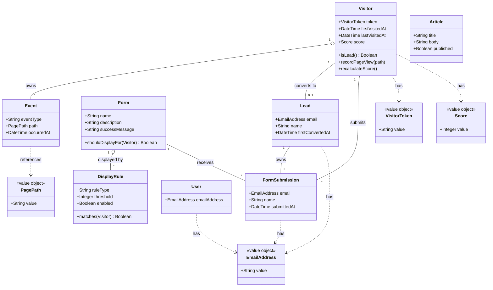

# マーケティングオートメーション学習用MVP 要件定義書

> 本書は、Ruby 3.4.9 / Rails 8.1.3 を用いた**学習目的の簡易マーケティングオートメーション(MA)ツール**の要件をまとめたものである。
> 特定のMAサービスの画面・文言・固有名称は一切模倣せず、MAの本質的な価値提供の流れ(匿名訪問者の行動を記録し、条件に応じて接点を作り、フォーム送信によってリード化する)だけを参考にしている。

---

## 1. プロダクト概要

匿名でWebサイトを訪問したユーザーの行動を記録し、特定の条件を満たした訪問者にフォームを表示することで、興味を持った匿名訪問者を「リード(連絡先がわかる見込み客)」に変換する一連の流れを、開発者1人がローカル環境でブラウザ操作だけで体験・確認できることを目的とする。

機能追加よりも、**主要な価値の流れがシンプルに伝わること**を最優先する。

### 1.1 技術スタック (確定事項)

| 項目 | 採用 |
|---|---|
| 言語 | Ruby 3.4.9 |
| フレームワーク | Rails 8.1.3 |
| DB | SQLite (Rails 8 デフォルト) |
| CSS | TailwindCSS (`tailwindcss-rails`) |
| 認証 | Rails 8 標準の `bin/rails generate authentication` |
| テスト | RSpec (`rspec-rails`) |
| バックグラウンドジョブ | 使用しない (同期処理のみ) |
| 外部API / 外部メール / CRM連携 | 使用しない |
| JavaScript | Rails標準 (importmap + Turbo) の範囲で最小限 |

### 1.2 設計上の優先順位

1. ローカルで1人で動作確認しやすいこと
2. 主要な価値の流れがシンプルに伝わること
3. 学習目的として、ドメインの関心ごとが言語化されていること
4. 将来の拡張(特定ページ加点、複合条件 など)の余地を残しておくこと

---

## 2. 想定ユーザー

- **直接の利用者**: 本ツールを開発・操作する開発者本人(学習者)
- **業務上の想定ユーザー**(開発上のペルソナ): BtoBサービスサイトを運営する架空のWeb担当者
  - 「自社サイトに来た人がどんな興味を持っているか把握したい」
  - 「興味がありそうな人にだけ問い合わせフォームを表示したい」
  - 「営業が優先的にアプローチすべき関心度の高いリードを判別したい」

---

## 3. 解決したい課題

1. Webサイト訪問者の大半は名乗らずに離脱してしまい、誰がどんな興味を持って訪問したか分からない
2. すべての訪問者に同じフォームを出してもコンバージョンしにくい(タイミングが悪いと逆に煩わしい)
3. 連絡先を取得できたリードでも、関心度合いが分からないと営業の優先順位が付けられない

---

## 4. MVP機能一覧 (6機能)

### 機能1: 匿名訪問者トラッキング (優先度: High)

- **何のための機能か**: ログインしていないユーザーを cookie で識別し、後の行動記録の主体とする
- **方式**: 初回アクセス時に署名付き永続cookie に UUID を発行し、`Visitor` レコードを作成
- **MVPに入れた理由**: 全機能の基盤。匿名識別ができないと「行動履歴」も「条件判定」も成立しない

### 機能2: ページ閲覧イベントの記録 (優先度: High)

- **何のための機能か**: 「どの訪問者が、いつ、どのページを見たか」を時系列で蓄積する
- **対象ページ**: DBに登録された `Article` の閲覧および公開トップページの閲覧
- **MVPに入れた理由**: スコア計算と表示ルール判定の元データであり、MAの「行動データ」を実体験できる最小単位

### 機能3: 条件付きフォーム表示 (優先度: High)

- **何のための機能か**: 関心度が高そうな訪問者にだけフォームを出すことで、無差別表示よりも効果的な接点を作る
- **MVPで扱う条件**: 「同じ訪問者が累計N回以上ページを閲覧したら、指定フォームを表示」(`visit_count_gte`) という閾値型1種類のみ
- **MVPに入れた理由**: 「条件に応じて接点を変える」というMAの中心思想を最低限の形で表現するため

### 機能4: フォーム送信によるリード化 (優先度: High)

- **何のための機能か**: 匿名訪問者の連絡先を取得し、識別可能な「リード」に変換する
- **仕様**: メール + 氏名を入力 → 当該 Visitor に紐づく `Lead` を作成。リード化前の行動履歴も引き続き同じ Visitor に紐づく
- **MVPに入れた理由**: 「匿名→顕在化」の状態遷移こそMAの本質的価値であり、これを実装しないと意味がない

### 機能5: 管理画面 (リード一覧 + 訪問者一覧 + 行動履歴 + 簡易スコア) (優先度: High)

- **何のための機能か**: 集めたデータを管理者が確認するための出口
- **含む要素**:
  - 訪問者一覧画面(リード化前を含む全訪問者)
  - 訪問者詳細画面(行動履歴)
  - リード一覧画面(スコア降順)※訪問者一覧とは**別ページ**
  - リード詳細画面(連絡先 + 行動履歴)
  - スコア表示
- **スコア加算ルール (MVP)**:
  - ページ閲覧 +1pt
  - フォーム送信 +3pt
  - **将来的に「特定ページ閲覧 +Npt」へ拡張できる構造を残す** (詳細は §13 参照)
- **MVPに入れた理由**: 蓄積データと変換結果を可視化できないと、開発者本人ですら学習成果を確認できない

### 機能6: 管理者ログイン (優先度: Medium)

- **何のための機能か**: 公開LPと管理画面が同居するため、最低限の入り口分離を行う
- **仕様**: Rails 8 標準の `bin/rails generate authentication` を利用し、1〜数名程度の管理者ユーザーで運用
- **MVPに入れた理由**: 公開ページにアクセスする訪問者と、管理画面を見る本人を区別する境界線が必要

---

## 5. 非MVP機能一覧 (除外理由付き)

| 機能 | 除外理由 |
|---|---|
| 本番向けメール配信 | 外部メール基盤に依存。学習スコープ外 |
| ステップメール | 配信基盤 + バックグラウンドジョブ前提で複雑度が跳ね上がる |
| 複雑なシナリオ分岐(if/elseワークフロー) | UI設計と実装が肥大化、MAの本質から外れる |
| ノーコードワークフロー | エディタ実装が肥大化 |
| 高度な分析ダッシュボード | BI寄りになりMA本質がぼやける |
| ABテスト | 統計設計と配信制御が必要 |
| AI/機械学習によるリード予測 | 学習スコープ外 |
| CRM/SFA連携 | 外部API依存 |
| 細かい権限管理(ロール/組織) | 1人運用には過剰 |
| バックグラウンドジョブによる集計処理 | MVPでは同期処理で十分 |
| リアルタイム通知 / WebSocket | 設計コストが大きい |
| マルチテナント | 1人学習用には過剰 |
| カスタムフォーム項目 (FormFieldの動的追加) | フォームは「メール+氏名」固定でMA本質は表現できる |
| 複合条件のルール(AND/OR) | ルールエンジンを避けたい |
| Articleのカテゴリ分類 | フラットな記事リストで十分。表示・トラッキング上の本質に影響しない |

---

## 6. ローカルでの動作確認シナリオ

シナリオ全体: **「サイトを何度か訪問した匿名訪問者が、フォーム入力で関心度の高いリードになるまで」**

### 6.1 事前準備

`bin/rails db:seed` で以下を投入:

- 管理者ユーザー 1名
- サンプル記事 (`Article`) 5件
- フォーム (`Form`) 1件 (問い合わせフォーム)
- 表示ルール (`DisplayRule`) 1件 「累計3回以上ページ閲覧したら、問い合わせフォームを表示」

### 6.2 操作手順

1. ブラウザA(通常モード)で `/` を開く → cookie に `visitor_token` (UUID) が発行され、`Visitor` レコードが作成される
2. サンプル記事 1〜3 を順に閲覧 → `Event` レコードが3件記録される
3. 4ページ目を開いた瞬間、ページ内に問い合わせフォームが表示される(累計閲覧数 ≥ 3 を満たすため)
4. メール + 氏名を入力して送信 → リード化、サンクスメッセージが表示される
5. `/admin/login` にログインしてダッシュボードへ
6. 訪問者一覧 → ブラウザAの訪問者が「リード化済」表示
7. リード一覧 → スコア順でブラウザAのリードが上位に並ぶ
8. リード詳細 → リード化前の閲覧履歴が同じ Visitor に紐づいて時系列表示される
9. プライベートウィンドウで `/` を開く → 別の `visitor_token` が発行され、別 Visitor として記録される

このシナリオを `bin/rails db:seed` 直後に再現できることがMVPの完成基準。

---

## 7. 各MVP機能の1人での確認方法

### 機能1: 匿名訪問者トラッキング
1. 公開LPに訪問する
2. ブラウザDevToolsの Application → Cookies で `visitor_token` を確認する
3. 管理画面の訪問者一覧で、新しい訪問者が1件追加されたことを確認する
4. プライベートウィンドウで開き直し、別 Visitor として記録されることを確認する

### 機能2: ページ閲覧イベントの記録
1. seedのサンプル記事を順に複数閲覧する
2. 管理画面の訪問者詳細で、閲覧したパスが時系列で表示されることを確認する
3. 同一訪問者で同じ記事を再度開き、履歴が増えることを確認する

### 機能3: 条件付きフォーム表示
1. seedの表示ルールが「3回以上閲覧で表示」になっていることを管理画面で確認する
2. 1〜3ページ目を閲覧する間はフォームが表示されないことを確認する
3. 4ページ目を開いた時点でフォームが表示されることを確認する
4. cookie を削除して新規訪問者になり、まだフォームが表示されないことを確認する

### 機能4: フォーム送信によるリード化
1. 表示されたフォームにメール + 氏名を入力して送信する
2. サンクスメッセージが表示されることを確認する
3. 管理画面のリード一覧に、送信内容が登録されていることを確認する
4. リード詳細画面で、リード化前の行動履歴が同じ画面に表示されることを確認する

### 機能5: 管理画面 (リード一覧 + 訪問者一覧 + スコア)
1. seedデータ + 自分でブラウザ操作した結果が訪問者一覧に表示されることを確認する
2. 訪問者一覧とリード一覧が**別ページ**として分かれていることを確認する
3. リード一覧の並びがスコア降順になっていることを確認する
4. 別ブラウザ/プライベートウィンドウで操作して、複数訪問者がスコアで比較できることを確認する

### 機能6: 管理者ログイン
1. 未ログイン状態で `/admin` にアクセス → `/admin/login` にリダイレクトされることを確認する
2. seedの管理者ユーザーでログイン → ダッシュボードに遷移できることを確認する
3. ログアウト → 再度 `/admin` で弾かれることを確認する

---

## 8. 画面一覧

### 8.1 公開側(一般訪問者向け)

| 画面 | パス | 役割 |
|---|---|---|
| トップ(LP) | `/` | 訪問の入口。記事一覧へ誘導する |
| 記事一覧 | `/articles` | 全記事(フラット)を一覧表示 |
| 記事詳細 | `/articles/:id` | 行動履歴を発生させるためのコンテンツ |
| フォーム表示 | (上記ページ内のオーバーレイ or 埋め込み) | 表示ルールを満たした時のみ表示 |
| フォーム送信完了 | `/forms/:id/thanks` | 送信成功時のサンクス |

### 8.2 管理側(`/admin` 配下、ログイン必須)

| 画面 | パス | 役割 |
|---|---|---|
| 管理者ログイン | `/admin/login` | 管理者の認証 |
| ダッシュボード | `/admin` | 訪問者数・リード数のサマリ |
| 訪問者一覧 | `/admin/visitors` | 全訪問者(リード化前後問わず) |
| 訪問者詳細 | `/admin/visitors/:id` | 行動履歴の時系列表示 |
| リード一覧 | `/admin/leads` | スコア降順 ※訪問者一覧と別ページ |
| リード詳細 | `/admin/leads/:id` | 連絡先 + 行動履歴 + フォーム送信履歴 |
| フォーム一覧 | `/admin/forms` | 登録済フォームの一覧 |
| フォーム編集 | `/admin/forms/:id/edit` | フォームの編集 |
| 表示ルール一覧 | `/admin/display_rules` | 登録済ルール一覧 |
| 表示ルール編集 | `/admin/display_rules/:id/edit` | ルールの編集 |
| 記事一覧(管理) | `/admin/articles` | サンプル記事の管理 |
| 記事編集(管理) | `/admin/articles/:id/edit` | 記事の編集 |

---

## 9. ユーザーストーリー

### 訪問者として
- 匿名のままサイトを閲覧したい(個人情報を渡したくない)
- 自分の興味があるテーマの記事を複数閲覧したい
- 関心がさらに深まったタイミングで問い合わせフォームを見たい
- メール + 氏名を入力して問い合わせを送信したい

### 管理者(Web担当者)として
- サイトに来ている匿名訪問者の数と行動を把握したい
- リード化済みの人と未リードの人を**別ページ**で区別して見たい
- スコアが高いリードから順に確認したい
- あるリードがリード化前にどのページを見ていたか把握したい
- フォームを表示する条件を編集したい
- 管理画面を未ログインユーザーから守りたい
- サンプル記事を追加・編集できるようにしたい(行動履歴を増やしてMVPの動作確認をしやすくするため)

---

## 10. 主要データモデル / テーブル案

学習用MVPとして 8テーブルに抑える。

### 10.1 `users` (管理者ユーザー)

Rails 8 標準の `bin/rails generate authentication` で作成。

| カラム | 型 | 備考 |
|---|---|---|
| id | bigint PK | |
| email_address | string | unique |
| password_digest | string | has_secure_password |

> Rails 8 標準の認証ジェネレータは `User` モデルと `Session` モデルを生成する。MVPでは管理者と一般ユーザーを区別しないので、`User` = 管理者として扱う。

### 10.2 `articles` (サンプル記事)

| カラム | 型 | 備考 |
|---|---|---|
| id | bigint PK | |
| title | string | not null |
| body | text | not null |
| published | boolean | default: true |
| timestamps | | |

> 学習用のため最小構成。カテゴリは持たない。

### 10.3 `visitors` (匿名訪問者)

| カラム | 型 | 備考 |
|---|---|---|
| id | bigint PK | |
| visitor_token | string | unique。署名付きcookieに格納するUUID |
| first_visited_at | datetime | |
| last_visited_at | datetime | |
| score | integer | default: 0 (キャッシュ) |
| timestamps | | |

> リード化されたかどうかは `Lead` 側に `visitor_id` を持たせ、`has_one :lead` で判定する(`lead_id` をVisitor側に持たない)。

### 10.4 `events` (行動イベント)

| カラム | 型 | 備考 |
|---|---|---|
| id | bigint PK | |
| visitor_id | bigint FK | not null |
| event_type | string | "page_view" / "form_submit" |
| path | string | nullable (form_submit時はnullでも可) |
| occurred_at | datetime | not null |
| timestamps | | |

> MVPでは `event_type` に `"page_view"` と `"form_submit"` の2種類のみ。
> 「特定ページ閲覧」を将来的に加点したい場合は、`path` の値を使ってスコア計算側で重み付けすればよい(§13 参照)。

### 10.5 `forms` (フォーム定義)

| カラム | 型 | 備考 |
|---|---|---|
| id | bigint PK | |
| name | string | 管理画面用名称 |
| description | string | 訪問者向け説明 |
| success_message | string | 送信完了時メッセージ |
| timestamps | | |

> MVPでは項目は「メール + 氏名」固定。`FormField` テーブルは作らない。

### 10.6 `form_submissions` (フォーム送信)

| カラム | 型 | 備考 |
|---|---|---|
| id | bigint PK | |
| form_id | bigint FK | not null |
| visitor_id | bigint FK | not null |
| email | string | not null |
| name | string | not null |
| submitted_at | datetime | not null |
| timestamps | | |

### 10.7 `leads` (リード)

| カラム | 型 | 備考 |
|---|---|---|
| id | bigint PK | |
| visitor_id | bigint FK | unique (1Visitor=1Lead) |
| email | string | not null |
| name | string | not null |
| first_converted_at | datetime | not null |
| timestamps | | |

### 10.8 `display_rules` (表示ルール)

| カラム | 型 | 備考 |
|---|---|---|
| id | bigint PK | |
| form_id | bigint FK | not null |
| rule_type | string | MVPでは `"visit_count_gte"` のみ |
| threshold | integer | 閾値(例: 3) |
| enabled | boolean | default: true |
| timestamps | | |

### 10.9 MVPでの単純化メモ

- **`events` テーブル1本に統合**: 「page_view」も「form_submit」も同じテーブルにまとめ、`event_type` で区別する。本来は別エンティティだが、「行動履歴」というUI上の関心が共通なので統合する
- **`forms` にカスタム項目(FormFields)を持たない**: MVPでは「メール + 氏名」固定。本来はフィールドを動的に持たせるが、MA本質を語る上で必須ではない
- **`display_rules` の条件は単一型**: `rule_type` + `threshold` の組み合わせのみ。本来は条件式の合成が必要だがMVPでは1種類のみ
- **`visitors.score` をDBにキャッシュ**: 本来は集計クエリで都度計算してもいいが、MVPでは Event 追加時に再計算してDBに保存する形でシンプル化
- **`articles` を最小構成に**: title / body / published のみ。カテゴリ・タグ・著者は持たない

---

## 11. ドメインモデルの説明

### 11.1 業務上の関心ごと

1. 匿名訪問者を識別して継続観察する
2. 訪問者の行動を時系列で蓄積する
3. 「条件を満たした」状態を検知して接点(フォーム表示)を作る
4. 接点を経由して匿名訪問者を識別可能なリードへ変換する
5. リードの関心度を可視化する

### 11.2 主要エンティティ

| エンティティ | 説明 |
|---|---|
| **Visitor** (匿名訪問者) | cookie ベースの識別子で同一ブラウザの継続性を保証する。「匿名」と「リード化済」の状態を持つ。集約ルート |
| **Event** (行動イベント) | 訪問者がある時点で行った行動。種類・発生時刻・対象パスを持つ。Visitor集約の子 |
| **Form** | 訪問者から情報を受け取るための定義。集約ルート |
| **DisplayRule** | どの条件を満たした訪問者にどのフォームを表示するか。Form集約の子 |
| **FormSubmission** | あるフォームに対する1回の送信内容 |
| **Lead** | 連絡先が判明したVisitor。Visitorと1対1。集約ルート |
| **Article** | サンプル記事。閲覧されることで Event を発生させる対象 |
| **User** (管理者) | 管理画面を利用する管理者 |

### 11.3 値オブジェクト候補

| 値オブジェクト | 説明 |
|---|---|
| **VisitorToken** | 署名付きcookieに格納される UUID。Visitor識別の唯一の手段 |
| **Score** | 0以上の整数。加算ルールに基づく派生値 |
| **PagePath** | URLパス文字列。クエリ除去・末尾スラッシュ正規化などを内包する余地 |
| **EmailAddress** | 形式バリデーションを内包する文字列ラッパー |

> MVPでは値オブジェクトを正式なクラスとして実装しなくてもよい(プリミティブで済ませてよい)。ただし「ここは値オブジェクトに昇格させる余地がある」と認識しておく。

### 11.4 集約候補

| 集約ルート | 子 | 関心ごと |
|---|---|---|
| **Visitor** | Event | 訪問者の行動の継続観察。状態と行動は常に一緒に扱う |
| **Form** | DisplayRule | フォームと「いつ表示するか」は一体で運用される |
| **Lead** | FormSubmission | リード化後の追加情報・更新を管理する関心ごと |
| **Article** | (子なし) | 単独のコンテンツ単位 |

### 11.5 主要な関連

- Visitor `1` ─ `0..1` Lead (リード化時に紐付く)
- Visitor `1` ─ `*` Event
- Form `1` ─ `*` DisplayRule
- Form `1` ─ `*` FormSubmission
- Visitor `1` ─ `*` FormSubmission
- Lead `1` ─ `*` FormSubmission

### 11.6 MVPであえてまとめた / 残した判断

- **EventをPageViewとFormSubmitに分けず、1モデルに統合**
  - 本来: PageView と FormSubmit は別の関心ごとで型も違う
  - MVP: 「時系列の行動履歴」というUI上の関心が共通なので統合
- **Form に FormField を持たせず、項目固定**
  - 本来: フォーム項目は動的に設計されるべき
  - MVP: 「リード化」というMAの本質は「項目の動的設計」抜きでも語れる
- **Visitor と Lead はあえて分けて残した**
  - 本来: 「人」という単一エンティティの状態違いとも解釈できる
  - MVP: 「匿名→顕在化」というMAの中心概念を分かりやすく示すため別エンティティで残す。
- **DisplayRule の条件を単一型に限定**
  - 本来: AND/OR、属性条件、時間帯条件など複合化される
  - MVP: ルールエンジンを避け、1種類だけで思想を表現する
- **Article をシンプルに保つ**
  - 本来: カテゴリ・タグ・著者・公開日時などを持つ
  - MVP: title / body のみ。閲覧トリガーとして機能すれば十分

---

## 12. mermaid classDiagram



---

## 13. Rails実装時の注意点

### 13.1 プロジェクト生成

```sh
rails new ma-cc -d sqlite3 --css tailwind --skip-test
cd ma-cc
bundle add rspec-rails --group "development, test"
bin/rails generate rspec:install
bin/rails generate authentication
```

- `--skip-test` で Minitest をスキップし、RSpec を導入する
- `--css tailwind` で `tailwindcss-rails` がセットアップされる
- 認証は `bin/rails generate authentication` で `User` / `Session` が生成される

### 13.2 公開側のトラッキング処理は1箇所にまとめる

`PublicController` (or `ApplicationController` の派生) の `before_action` で:

1. cookie から `visitor_token` を取り出す(なければ `SecureRandom.uuid` で発行し、`cookies.permanent.signed[:visitor_token]` にセット)
2. `Visitor.find_or_create_by(visitor_token: token)` で取得・作成
3. `Event` (`event_type: "page_view"`, `path: request.path`) を作成
4. `Visitor#recalculate_score!` を呼ぶ

```ruby
class PublicController < ApplicationController
  before_action :track_visitor

  private

  def track_visitor
    token = cookies.permanent.signed[:visitor_token] ||= SecureRandom.uuid
    @current_visitor = Visitor.find_or_create_by(visitor_token: token) do |v|
      v.first_visited_at = Time.current
    end
    @current_visitor.update(last_visited_at: Time.current)
    @current_visitor.events.create!(
      event_type: "page_view",
      path: request.path,
      occurred_at: Time.current
    )
    @current_visitor.recalculate_score!
  end
end
```

### 13.3 スコア計算 (拡張余地を残した設計)

スコア計算は **PORO (Plain Old Ruby Object)** に切り出す。これにより将来「特定ページ加点」を追加するときに、ロジックの追加場所が明確になる。

```ruby
# app/models/score_calculator.rb
class ScoreCalculator
  PAGE_VIEW_POINT   = 1
  FORM_SUBMIT_POINT = 3

  # 将来の拡張ポイント:
  # PATH_BONUS = { "/articles/5" => 4 } のような形で
  # 特定ページ加点を追加できる
  PATH_BONUS = {}.freeze

  def initialize(visitor)
    @visitor = visitor
  end

  def call
    @visitor.events.sum { |event| points_for(event) }
  end

  private

  def points_for(event)
    base_points(event) + path_bonus(event)
  end

  def base_points(event)
    case event.event_type
    when "page_view"   then PAGE_VIEW_POINT
    when "form_submit" then FORM_SUBMIT_POINT
    else 0
    end
  end

  def path_bonus(event)
    PATH_BONUS[event.path].to_i
  end
end
```

そして `Visitor` 側からはこう呼ぶ:

```ruby
class Visitor < ApplicationRecord
  has_many :events, dependent: :destroy
  has_one  :lead

  def lead?
    lead.present?
  end

  def recalculate_score!
    update!(score: ScoreCalculator.new(self).call)
  end
end
```

将来拡張するときは `PATH_BONUS` を DB テーブル化して `ScoreCalculator` の中だけを書き換えればよい。**他の層は変更不要**。

### 13.4 管理画面のルーティング分離

- `namespace :admin do ... end` でルーティング分離
- `Admin::ApplicationController` で認証 `before_action` を集約
- Rails 8 標準の認証ジェネレータが生成する `Authentication` モジュールを include する

### 13.5 フォーム表示判定はサーバーサイド

- JavaScript には頼らず、ページレンダリング時に「このVisitorに対して表示すべきフォーム」を1件選んで partial で挿入
- `Form#should_display_for?(visitor)` のようなメソッドに判定を集約
- `DisplayRule#matches?(visitor)` で個別ルール判定

```ruby
class DisplayRule < ApplicationRecord
  belongs_to :form

  def matches?(visitor)
    return false unless enabled?

    case rule_type
    when "visit_count_gte"
      visitor.events.where(event_type: "page_view").count >= threshold
    else
      false
    end
  end
end
```

### 13.6 訪問者一覧とリード一覧の分離

- 別コントローラ・別ビューにする (`Admin::VisitorsController` と `Admin::LeadsController`)
- リード一覧は `Lead.joins(:visitor).order("visitors.score DESC")` のようにスコア降順
- N+1 を避けるため `includes(:visitor)` を併用する

### 13.7 テスト方針 (RSpec)

- **モデルスペック**: `Visitor`、`ScoreCalculator`、`DisplayRule#matches?` を中心に
- **リクエストスペック**: 公開ページの `before_action` でVisitorとEventが正しく作られるか
- **システムスペック**: §6 のシナリオを1本通すことを最優先 (これがMVP完成基準)

### 13.8 避けるべきこと

- フォーム表示条件を複合化する (AND/OR の導入)
- イベント種別を増やしすぎる
- ステップメール等の「時間軸を持つ自動処理」を持ち込む
- フロントに JavaScript フレームワークを導入する
- スコア計算をモデルやコントローラに分散させる(必ず `ScoreCalculator` に集約)

---

## 14. 開発ステップ

実装は上から順に進める。各ステップ完了時に動作確認できるサイズに分割している。

| Step | 内容 | 確認方法 |
|---|---|---|
| 1 | プロジェクト生成 (`rails new ma-cc -d sqlite3 --css tailwind --skip-test`)、Ruby 3.4.9 / Rails 8.1.3 で起動確認 | `bin/dev` でWelcomeページが表示 |
| 2 | RSpec 導入 (`bundle add rspec-rails`、`generate rspec:install`)、サンプルspecが緑 | `bundle exec rspec` |
| 3 | 認証導入 (`bin/rails generate authentication`)、`User` モデル + `/admin/login` だけ作る | seed管理者でログインできる |
| 4 | `Article` モデル + 公開LP + 記事一覧 + 記事詳細 (seedで5件) | ブラウザで `/`、`/articles`、`/articles/:id` が見える |
| 5 | `Visitor` + `Event` モデル、公開ページ全体に before_action でトラッキング | DevToolsでcookie発行 + DBに `Visitor` / `Event` が増える |
| 6 | 管理画面 (`Admin::VisitorsController`) で訪問者一覧 / 訪問者詳細 | 自分のブラウザ操作が可視化される |
| 7 | `Form` モデル + 公開ページに常時表示でフォームを実装 (まずは無条件で出す) | フォーム送信ができる |
| 8 | `FormSubmission` + `Lead` モデル、送信時にリード化 | 管理画面のリード一覧 (`Admin::LeadsController`) に登場 |
| 9 | `DisplayRule` モデル + 表示ルール判定で「条件を満たした時のみ表示」に切り替え | 閾値未満で出ない、超えたら出る |
| 10 | `ScoreCalculator` 導入 + リード一覧のスコア降順表示 | 行動が多い訪問者ほど上位 |
| 11 | seedデータ整備 (管理者・記事5件・フォーム1件・表示ルール1件) | `bin/rails db:seed` 直後に §6 のシナリオを再現できる |
| 12 | RSpec のシステムスペックを1本 (§6 のシナリオを自動化) | `bundle exec rspec spec/system` で緑になる |

---

## 付録: 確定した設計方針サマリ

| 項目 | 確定内容 |
|---|---|
| 認証 | Rails 8 標準 `bin/rails generate authentication` |
| CSS | TailwindCSS |
| テスト | RSpec |
| 記事ページ | `Article` モデル(DB)として持つ。シンプル構成。カテゴリなし |
| スコア加算 | ページ閲覧 +1pt / フォーム送信 +3pt。`ScoreCalculator` に集約し、特定ページ加点への拡張余地を残す |
| 表示ルール条件 | `visit_count_gte` の1種類のみ |
| 訪問者一覧とリード一覧 | 別ページに分離 |
| バックグラウンドジョブ | 使用しない |
| 外部連携 | 行わない |

最優先事項: **ローカルで1人で動作確認しやすいこと**、および **主要な価値の流れがシンプルに伝わること**。
